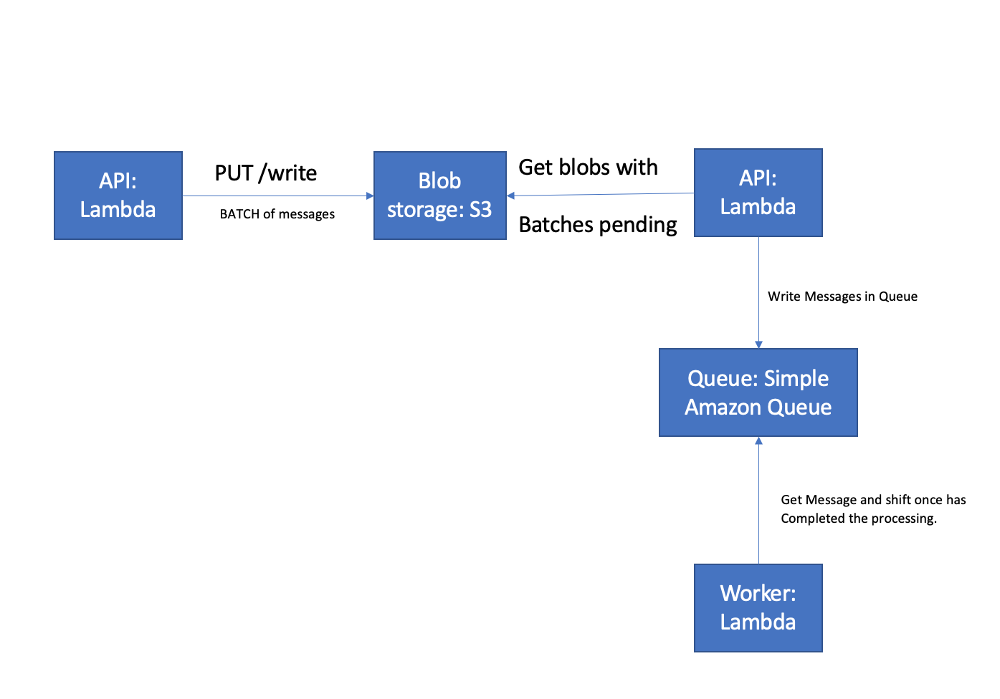

## WONDER QUEUE

Wonder Queue is a test development to address backend skills, implementing queue storage, in this case we develop the storage and library to manipulate our queue with local storage. To describe this project we detail all the main libraries used:


-	Typescript: as a programming standard.
-	Express: set our restful API.
-	Lokijs: manage our JavaScript in-memory. 
-	Momentjs: manipulate dates and times.
-	Jestjs: run our TDD
-	Nodemon: hot reloading

Main functionalities of our queue storage management:

-	In our .env we have defined our default queue, it means that we can call almost all our methods without specify queue.
-	We can create new queues.
-	In our .env we have defined our default expiration time, this integer is expressed in seconds. 
-	We develop and independent method to subscribed a worker in a queue. It was intentional to test when a client try to access messages already taken and how we can still adding new messages and how we can run a new worker and take these new ones. It mean that we can have many workers doing operation in the same queue but they are dealing with different messages. (on testing definitions these case are more clear)
-	we can write a batch of messages and receive a poll of ids as response. 
-	To guarantee a full execution of our workers each time a message is shift out the subscription’s queue expiration dates are updated by the same process. 

## Installation

```bash
$ npm install
```

## Running the app

```bash
# development
$ npm run start

# build mode
$ npm run tsc
```
## Test

```bash
# unit tests
$ npm run test:unit
```

## what steps would you need to take in order to scale this system to make it production-ready for very high volume?

For very high volume with have to change the architecture. This project is a good quiz to evaluate queue storage management and implementation. Basically, this type of initiatives has many pieces to make interactions with the queue. For example usually is an API who writes in our queues but are serverless the workers. What does exactly means? Once API has sent batch of messages is a second plan is executed our workers. But, what happened if we want send a really high volume in our payload endpoint? We have to wait the response of our endpoint once writing process has completed too? The answer of it is NOT. We send the complete batch in a blob storage account and wen can have a serverless working only for writing processes.

